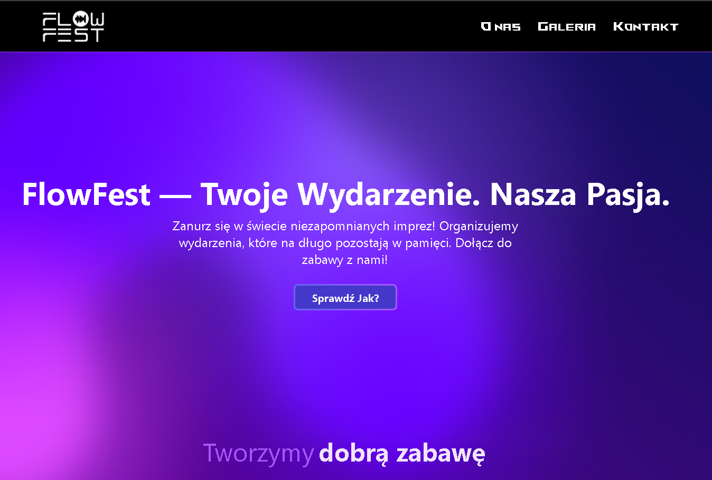

# 🎉 FlowFest – Oficjalna Aplikacja Firmy FlowFest

Oficjalnej aplikacja firmy **FlowFest** – firma organizująca i promująca niezapomniane wydarzenia muzyczne w Polsce.

Stworzyłem tą aplikację, ponieważ sam należe do organizacji FlowFest i było to działanie non-profit. Mogłem dzięki temu wesprzeć organizację jak i zyskać doświadczenie w tworzeniu stron. Docelowo miał być to tylko projekt na zaliczenie przedmiotu studiów, aczkolwiek teraz jest to pełna aplikacja gotowa do przyszłego rozwoju.

---

## 🌐 Demo na żywo

Aplikacja jest zdeployowana na [Netlify](https://www.netlify.com/) z ustawionymi własnymi rekordami DNS oraz zakupioną domeną:  
🔗 **[flowfest.pl](https://flowfest.pl)**

---

## 🖼️ Podgląd interfejsu

Poniżej znajdziesz podgląd wyglądu aplikacji (dodaj własny screen):

---

## 🚀 Technologie

Projekt został zbudowany przy użyciu najnowszych technologii:

- **Next.js** – framework React dla SSR i SSG
- **Tailwind CSS** – stylowanie z wykorzystaniem klas utility
- **Framer Motion** – płynne i estetyczne animacje
- **Formik + Yup** – zarządzanie formularzami i walidacja
- **Cloudinary** – zarządzanie zdjęciami w galerii
- **TypeScript** – bezpieczny i skalowalny kod
- **Netlify** – hosting i CI/CD
- **Snyk** – CI pipeline i bezpieczeństwo
- **wiele innych**

---

## 💼 Funkcjonalności

- Interaktywna strona główna i galeria
- Sekcja "O nas", "Kontakt", "Oferta"
- Formikowe formularze z walidacją YUP (kontakt, logowanie)
- Własny CMS z ContextAPI do zarządzania postami
- Responsywny design – działa idealnie na telefonach
- Modalne zdjęcia z animacją
- Animacje i styl zachowany w tematyce **FlowFest**
